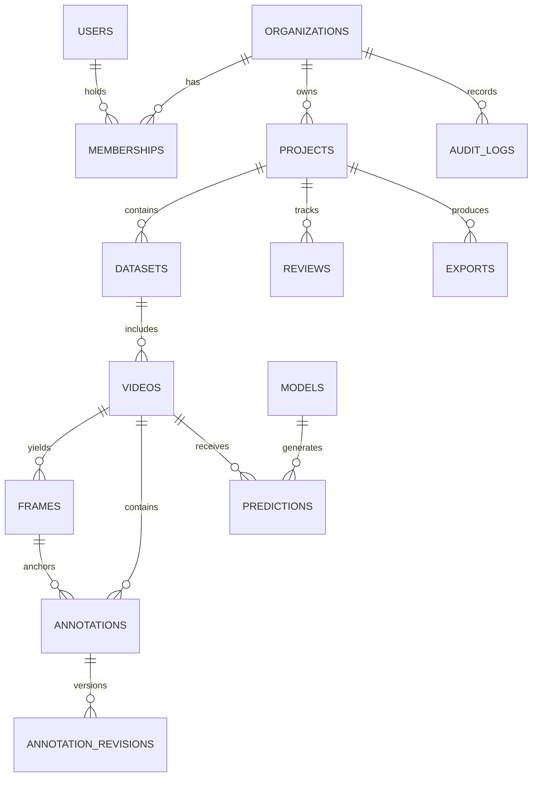

# Data Model

PostgreSQL holds normalized transactional metadata; object storage holds source and derived binary media. All tenant-owned tables carry `organization_id` directly or inherit it through a constrained parent and are queried through an organization-scoped repository boundary.

## Core tables

| Table | Key columns and constraints | Indexes |
| --- | --- | --- |
| `users` | UUID PK, unique case-insensitive email, password hash, active flag | unique normalized email |
| `organizations` | UUID PK, unique slug, display name | unique slug |
| `memberships` | user/org FK, role enum, unique `(organization_id, user_id)` | org/user lookup |
| `projects` | org FK, slug, name, archived timestamp, unique `(organization_id, slug)` | org + active ordering |
| `datasets` | project FK, slug, version state, unique `(project_id, slug)` | project + created time |
| `videos` | dataset FK, storage key, SHA-256, duration, processing state | dataset/state; checksum |
| `frames` | video FK, frame number, timestamp, unique `(video_id, frame_number)` | video/timestamp |
| `annotations` | video/frame FK, type, geometry JSONB, track key, status | video/time; track key; GIN geometry metadata |
| `annotation_revisions` | annotation FK, monotonic revision, actor FK, payload, unique `(annotation_id, revision)` | annotation/revision |
| `models` | org FK or platform scope, immutable name/version/capabilities | unique scope/name/version |
| `predictions` | model/video FK, inference run ID, confidence, payload | video/model; review state |
| `reviews` | annotation or task target, assignee, decision, rationale | assignee/status |
| `comments` | polymorphic subject guarded by application/service constraints | subject + created time |
| `exports` | dataset version FK, format, manifest URI, checksum, state | dataset/state |
| `audit_logs` | org FK, actor, action, subject, request ID, immutable payload | org/time; subject; request ID |
| `notifications` | user/org FK, type, delivery/status timestamps | recipient/unread |
| `settings` | organization FK, validated key/value schema, unique `(organization_id, key)` | org/key |

## Data integrity rules

- UUID primary keys are generated by the application and never inferred from client input.
- Foreign keys use restrictive deletion for auditable history; destructive actions become archival or explicit retention jobs.
- Database constraints protect natural uniqueness. Services provide readable conflict errors, but never rely only on application validation.
- JSONB is reserved for versioned geometries, model payloads, and validated settings; searchable/relational attributes remain normalized columns.
- Every migration is Alembic-managed, reviewed, reversible where practical, and tested against an empty database and an upgrade path.
