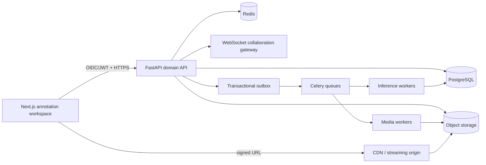
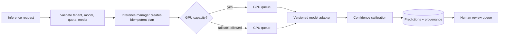
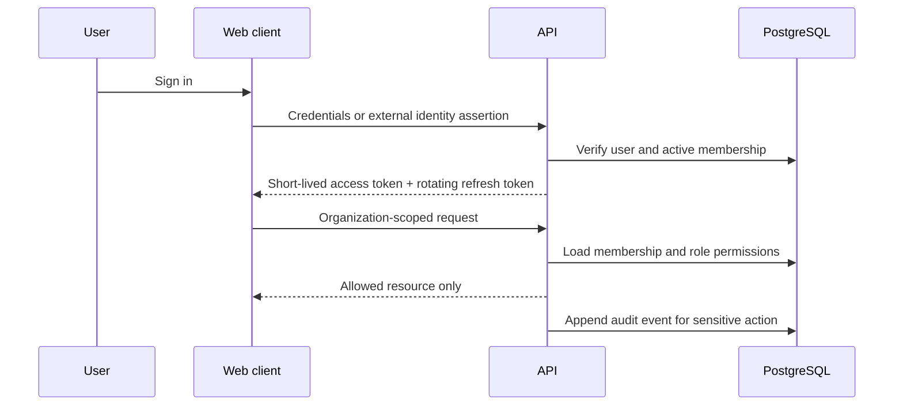
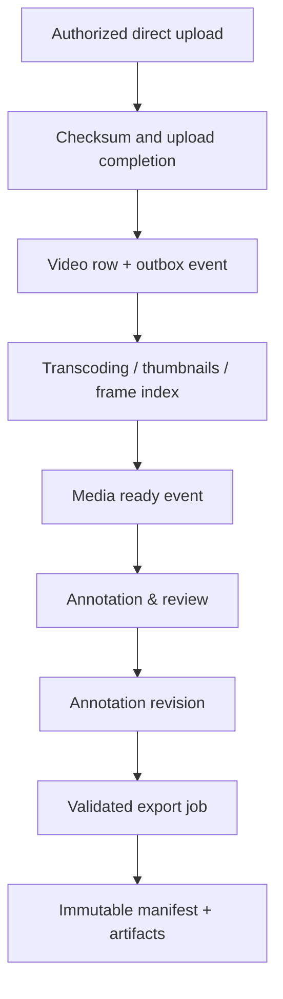
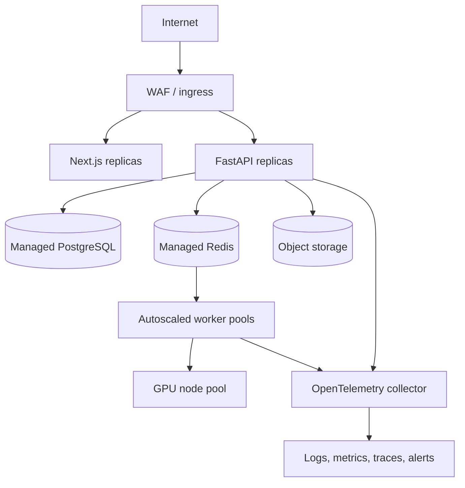

# System Architecture

## Architectural principles

- **Modular monolith first:** the API owns core transactional boundaries while workers and inference adapters remain independently deployable. This keeps early development coherent without preventing later service extraction.
- **PostgreSQL is the source of truth:** Redis is a cache/queue broker, never the durable record of annotation state.
- **Object storage is immutable-by-default:** source video, derived media, exports, and model artifacts are addressed through metadata and signed, time-limited URLs.
- **Events are durable:** transactional writes create outbox records; workers publish downstream events after commit.

## Backend and frontend

The web client uses React Query for server state, Zustand for editor-local state, and a typed OpenAPI client for domain calls. Browser editing state is isolated from persisted annotation revisions so an interrupted session can be reconciled safely.

## AI pipeline

Adapters expose a stable capability contract, rather than leaking model-specific formats into annotation tables. YOLO, ByteTrack, SAM2, PaddleOCR, and video-language models are implementation details behind that contract.

## Authentication and authorization

Tokens include subject, token type, expiration, issuer, audience, and a revocation-aware session identifier. Every organization-scoped repository call requires an organization predicate, even when a resource UUID is known.

## Storage and event flow

## Deployment

Network policy isolates database and worker resources. Secrets are provided by a managed secret store, not image layers or repository files. The Terraform-ready and Kubernetes configuration will encode these boundaries as the deployment subsystem is added.
